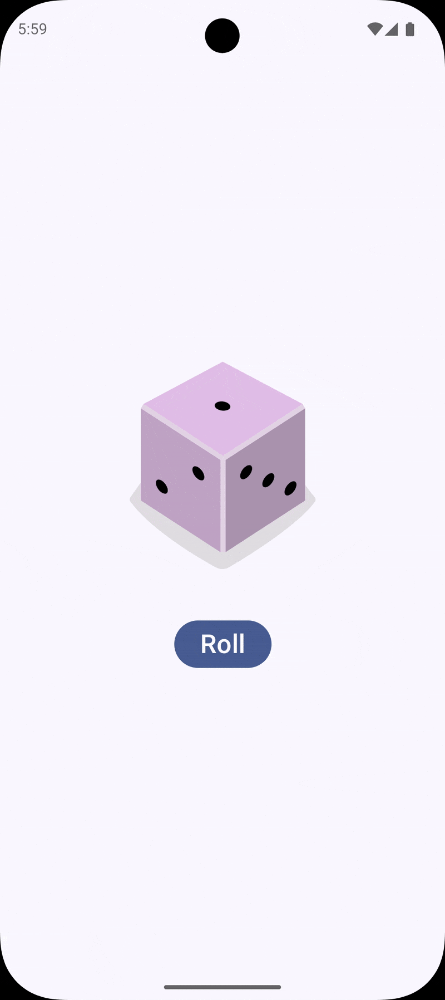

---

### README File

---

# Dice Roller App

This is a Dice Roller app built using **Kotlin** and **Jetpack Compose**. It simulates a dice roll and displays the result as a dice face image. The user can click the "Roll" button to generate a random number between 1 and 6, which is then shown as a corresponding dice image.

## Features

- **Random Dice Roll**: Generates a random number between 1 and 6 when the button is clicked.
- **Dynamic Image Update**: The app displays the correct dice face based on the rolled number.
- **Simple UI**: A clean and minimal user interface built with Jetpack Compose.

## Working



## Installation

To run this app, follow these steps:

1. Clone this repository:
    ```bash
    git clone https://github.com/RishantBana/diceroller-app.git
    ```

2. Open the project in **Android Studio**.

3. Make sure you have the latest version of **Kotlin** and **Jetpack Compose**.

4. Run the project on an emulator or a physical device.

## Configuration

The dice images are stored in the `res/drawable/` folder. You can customize the dice images by replacing the `dice_1`, `dice_2`, etc., with your preferred images.

## Tech Stack

- **Kotlin**: The primary language for building the app.
- **Jetpack Compose**: A modern toolkit for building native UIs.
- **Android Studio**: The IDE for Android development.

---

### Key Components of the Code:
- **DiceWithButtonAndImage Composable**: Handles the display of the dice image and the button. The button triggers the dice roll.
- **Result State**: The app uses `mutableStateOf` to store the result of the dice roll, which is used to select the appropriate image.
